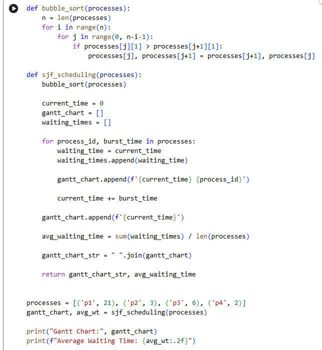

<div align="center">

# 🚀 SJF CPU Scheduling Simulator

### Shortest Job First (SJF) Scheduling Algorithm in Python

[](https://www.python.org/)
[](LICENSE)
[](https://colab.research.google.com/github/tausif112/SJF-CPU-Scheduling-Simulator/blob/main/SJF.ipynb)

</div>

---

## 📌 Overview

A Python-based implementation of the **Shortest Job First (SJF)** CPU Scheduling Algorithm. The project sorts processes according to burst time, executes the shortest process first, calculates waiting times, and generates a simple Gantt Chart representation.

Developed and tested using **Google Colaboratory (Google Colab)**.

---

## ✨ Features

* SJF Scheduling Simulation
* Bubble Sort Based Process Ordering
* Waiting Time Calculation
* Average Waiting Time Calculation
* Gantt Chart Generation
* Google Colab Notebook Included

---

## 🧠 About SJF

SJF (Shortest Job First) is a non-preemptive CPU scheduling algorithm where the process with the shortest burst time is executed first.

### Advantages

* Reduces average waiting time
* Efficient for batch processing
* Simple to understand and implement

### Limitations

* Requires prior knowledge of burst time
* Longer processes may wait more
* Can cause starvation for large processes

---

## ⚙️ Algorithm

1. Take a list of processes with their burst times.
2. Sort the processes in ascending order of burst time.
3. Start execution from time 0.
4. Calculate waiting time for each process.
5. Update the current execution time.
6. Generate the Gantt Chart.
7. Calculate Average Waiting Time.

---

## 🧮 Input

```python
processes = [
    ('P1', 21),
    ('P2', 3),
    ('P3', 6),
    ('P4', 2)
]
```

## 📊 Output

```text
Gantt Chart: 0 P4 2 P2 5 P3 11 P1 32

Average Waiting Time: 4.50
```

---

## 📈 Gantt Chart

```text
0      2      5       11                  32
| P4 | P2 |  P3  |         P1          |
```

---

## 📸 Google Colab Workspace



---

## 📈 Program Output


---

## 📂 Project Structure

```text
SJF-CPU-Scheduling-Simulator/
│
├── SJF.ipynb
├── sjf.py
├── README.md
├── LICENSE
├── .gitignore
│
└── screenshots/
    ├── colab-workspace.png
    └── output.png
```

---

## 🚀 Run Locally

```bash
git clone https://github.com/tausif112/SJF-CPU-Scheduling-Simulator.git

cd SJF-CPU-Scheduling-Simulator

python sjf.py
```

---

## 🛠 Technologies Used

| Technology        | Purpose                 |
| ----------------- | ----------------------- |
| Python            | Core Implementation     |
| Google Colab      | Development Environment |
| GitHub            | Version Control         |
| Operating Systems | Scheduling Concepts     |

---

## 🔮 Future Improvements

* Arrival Time Support
* Turnaround Time Calculation
* Response Time Calculation
* Preemptive SJF / Shortest Remaining Time First
* Comparison with FCFS
* Graphical Gantt Chart Visualization
* Interactive User Input

---

## 📄 License

This project is licensed under the MIT License.

---

## 👨‍💻 Author

### Md Tausif Uddin

Department of Computer Science & Engineering (CSE)  
University of Asia Pacific (UAP)

GitHub: https://github.com/tausif112


⭐ If you found this project useful, consider giving it a star.
